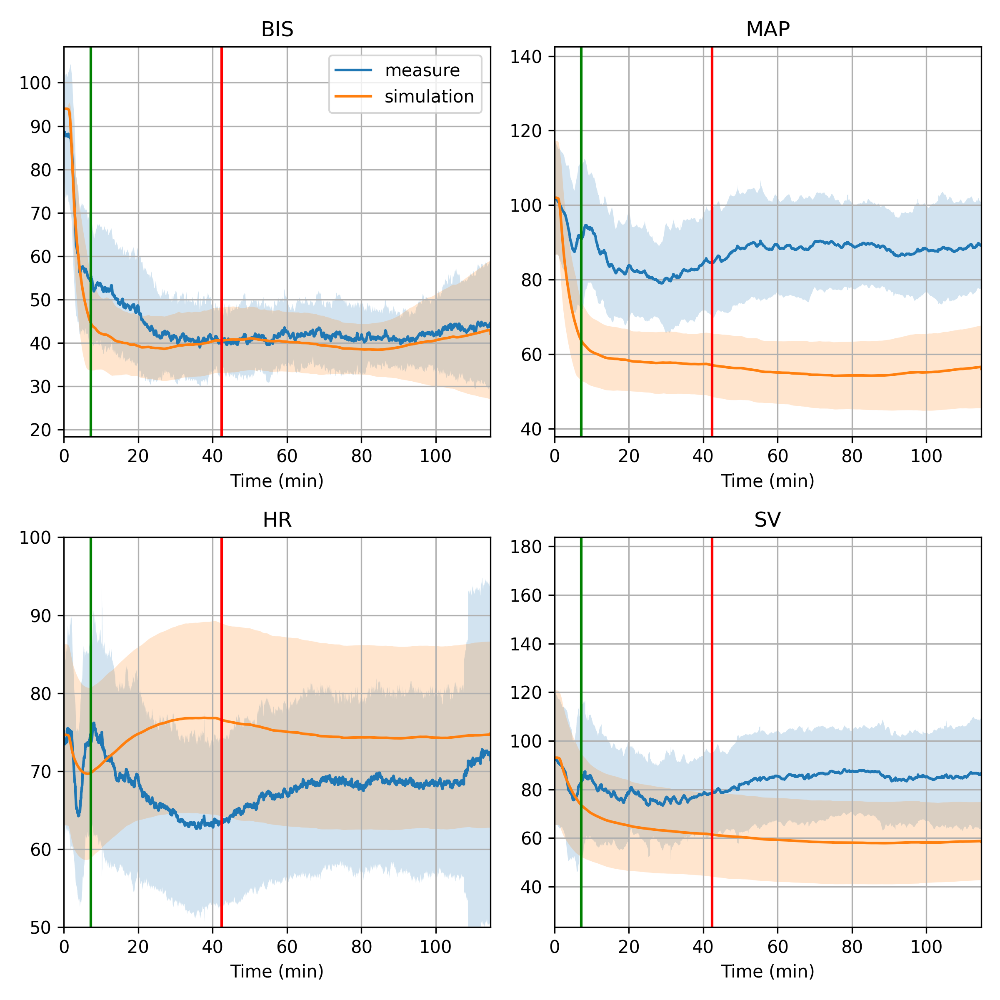
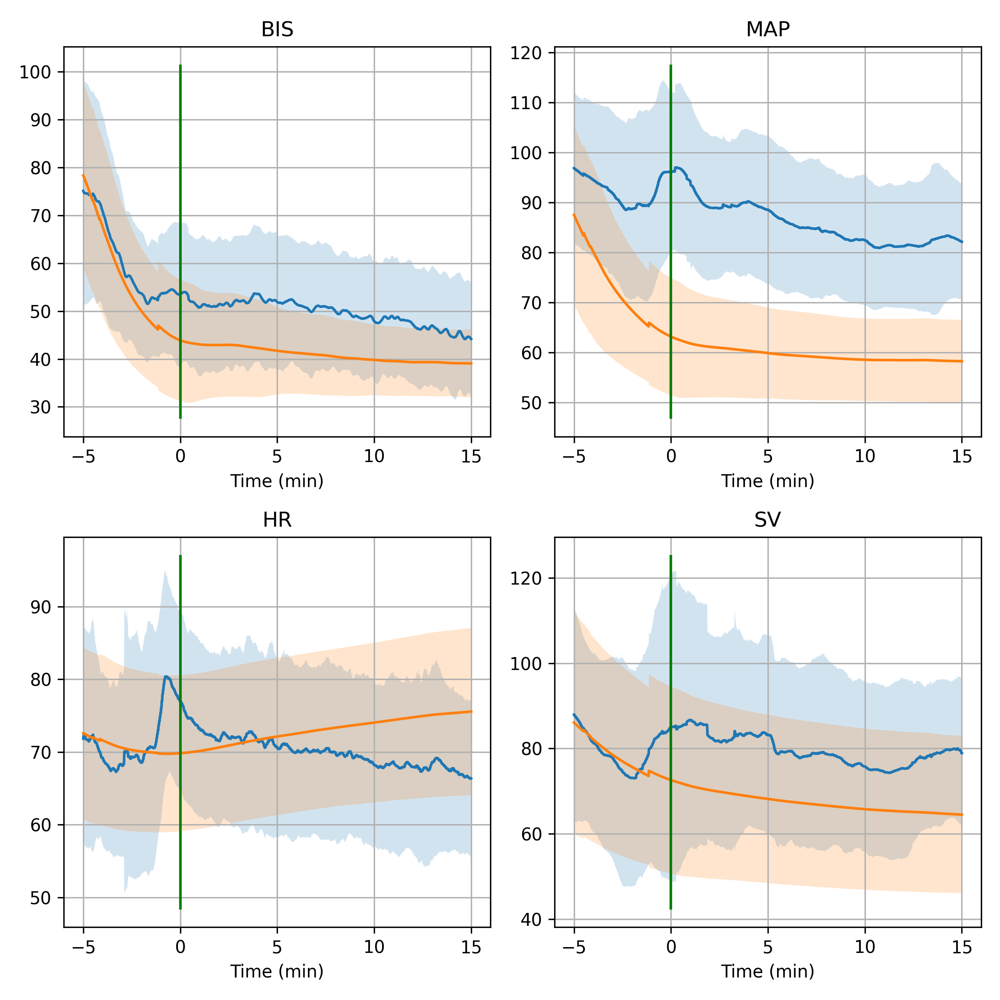
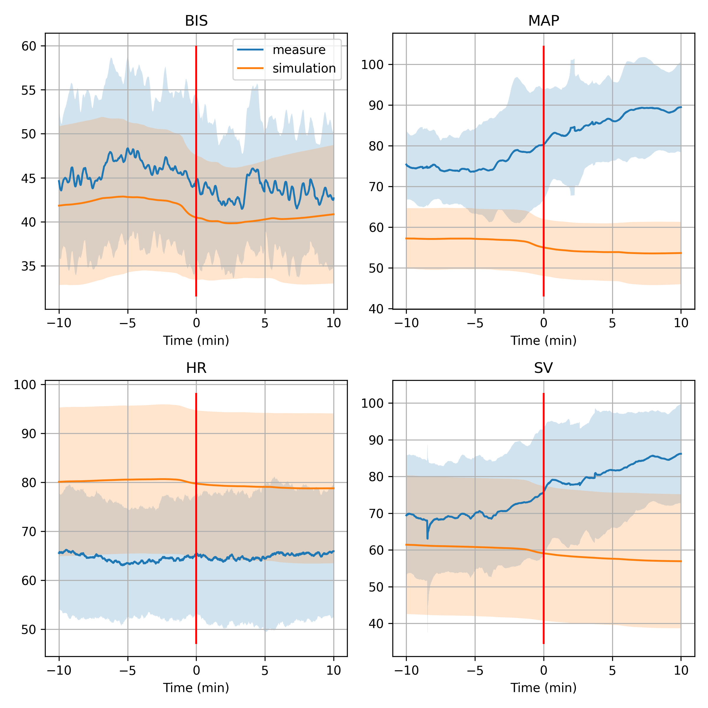
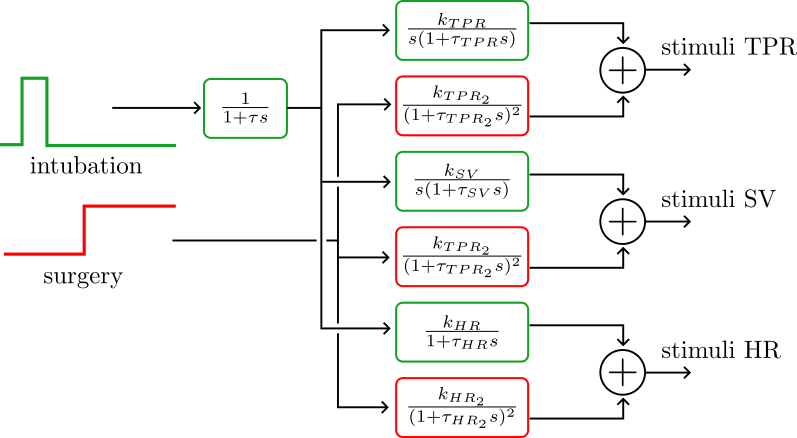
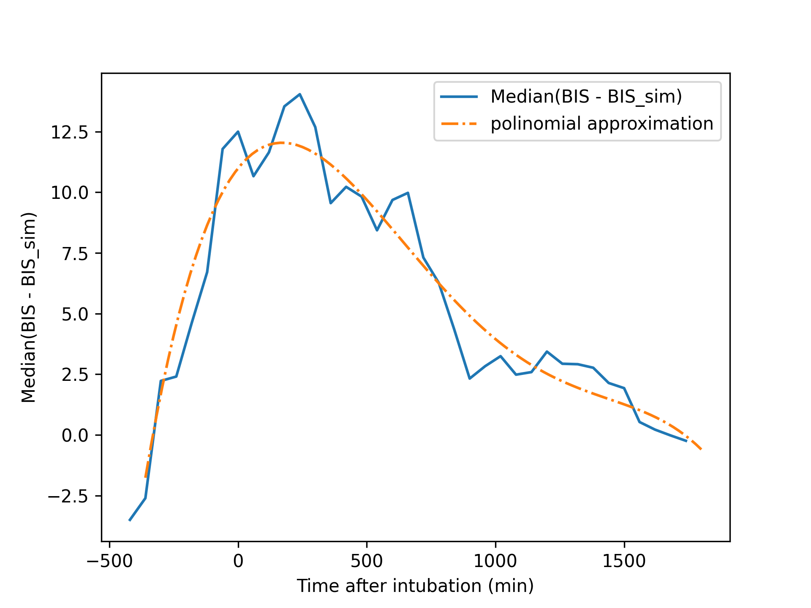
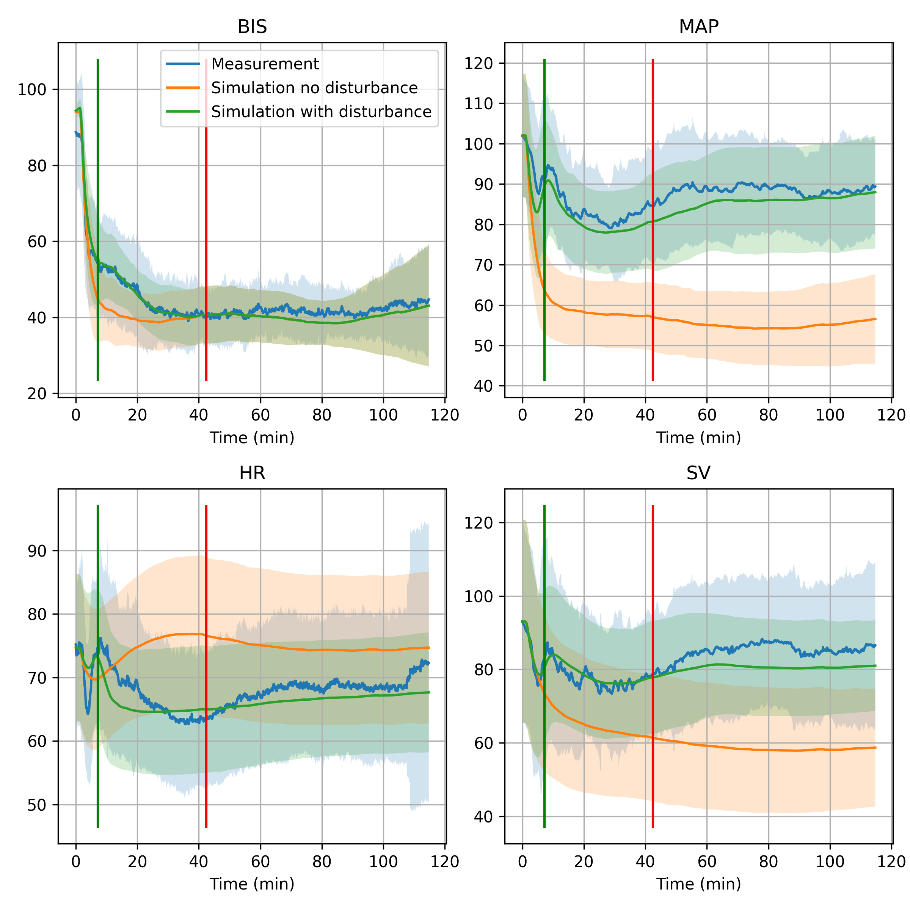

.. _disurbance_identification:

Disturbance Modelling and Identification
============================================

This section describes how to model and identify disturbances in the physiological system using the Python Anesthesia Simulator. Disturbances can arise from various sources, such as surgical stimuli, patient movements, or changes in physiological states. Here we used data from the VitalDB database to identify a model of the disturbance affecting the the haemodynamic system during surgery.

All the code used to download the vitalDB data, perform the simulation and generate figures and results presented in this section is available in the git repository `PAS_vs_VitalDB <https://github.com/AnesthesiaSimulation/PAS_vs_vitalDB>`_.

Raw simulated data VS real data
--------------------------------

To select a relevant subset of data from the VitalDB database we used the following criteria:

- Total intravenous procedure;
- Case duration > 90 minutes;
- No bolus injection of drug with main effect on hypnoses or analgesia;
- less than 200mL of total estimated blood loss;
- BIS and invasive arterial pressure recording available;
- Non-invasive arterial pressure measurement available before induction.

The selected data set contains 54 patients with the following characteristics:

+-----------------------------------------+----------------------+
| Parameter                               | mean [min, max]      |
+=========================================+======================+
| Age (yr)                                | 56 [17–76]           |
+-----------------------------------------+----------------------+
| Weight (kg)                             | 60 [42–97]           |
+-----------------------------------------+----------------------+
| Height (cm)                             | 164 [150–180]        |
+-----------------------------------------+----------------------+
| Sex                                     | 20 Female, 34 Male   |
+-----------------------------------------+----------------------+
| Preoperative hypertension               | 27.78 %              |
+-----------------------------------------+----------------------+
| Preoperative diabetes mellitus          | 18.52 %              |
+-----------------------------------------+----------------------+
| **Surgery type**                        |                      |
+-----------------------------------------+----------------------+
|   Thoracic                              | 25                   |
+-----------------------------------------+----------------------+
|   Digestive                             | 21                   |
+-----------------------------------------+----------------------+
|   Vascular                              | 2                    |
+-----------------------------------------+----------------------+
|   Others                                | 6                    |
+-----------------------------------------+----------------------+

   Green line is median en of intubation time end red line is median of surgical operation start time.

The figure above shows a comparison between real data from the VitalDB database (in blue) and simulated data from the Python Anesthesia Simulator (in orange). The simulated data is generated using the rate of propofol and remifentanil available in the clinical data. One can observe that there is an important difference between MAP measurement and the simulation output. In addition of a probable bias of the model itself due to a difference of patient population this difference might be explain by the additive effect of nociceptive stimulus and effect of drug indirectly affecting the hemodynamic system such as rocuronium. To investigate more accurately the effect of nociceptive stimulus, the following figures displays averaged measurement and simulator output synchronized at the end of intubation and at start of surgical operation.

   Raw simulated data VS real data synchronized at the end of intubation. 

   Raw simulated data VS real data synchronized at start of surgical operation

Modelling the disturbances
----------------------------

To model the disturbances affecting the hemodynamic system we consider an additive model on the output function of each state with the form:

.. math::
   \begin{align}
   TPR &= TPR^* + \textcolor{blue}{stimuli\_TPR} \\
   HR  &= HR^* + LTDE_{HR} + \textcolor{blue}{stimuli\_HR} \\
   SV  &= (SV + LTDE_{SV} + \textcolor{blue}{stimuli\_SV})(1 - \alpha \log(\tfrac{HR}{HR_{base}})) \\
   MAP &= HR \times SV \times TPR.
   \end{align}

Note that because of the re-injection of MAP in the haemodynamic model, the disturbances added to the output signal also affect the states dynamics, which prevent a direct identification of the disturbance model from the output error only. However, this choice was made to keep the physiological meaning of the states and the model.

The dynamic of the stimuli affecting the states is modelled using transfer functions with a step input representing either the start of intubation or the start of surgical operation. More precisely the following scheme is used to compute the stimuli affecting each state:

   Scheme of the stimuli transfer functions

The form of the transfer functions was chosen to fit the physiological response to a nociceptive stimul5us while keeping a low number of parameters to identify.

For BIS, a simple additive signal on the output function is used to model the effect of disturbance on BIS signal:

.. math::
   BIS = BIS^* + \textcolor{blue}{stimuli\_BIS}

where :math:`stimuli\_BIS` is given in a polinomial function depending on time. Because of the low sensitivity of BIS to start of surgery in the given data, we only consider the effect of intubation on BIS signal.

Identification of the disturbance model
-----------------------------------------

To have a model that reproduce the vitalDB data more accurately, in addition of identifying the parameters of the disturbance model we also re-identify the most sensitive parameters of the haemodynamic model. In fact, we do observe significant difference of dynamics between the simulator and the real data (notably on HR) that oculd be explain by different factors: patient condition, measurement difference, mechanical ventilation etc..Thus we choose to re-identify the following parameters of the haemodynamic model: :math:`int_{hr}`, :math:`fb`, and :math:`E_{max\_propo\_TPR}`. A sensitivity analysis of the haemodynamic model to its parameters is available in [Fregolent2025]_.

The identification is performed in two steps, to reduce the number of parameters to identify at once and to be able to dissociate the effect of intubation and surgical operation:

- First we identify the parameters of the haemodynamic model along with the parameters of the disturbance model related to the intubation period. The identification is performed on the period starting at the start of propofol administration and ending 5 minutes before start of surgical operation. 

- Second we identify the parameters of the disturbance model related to the surgical operation period. The identification is performed on the overall anesthesia period.

The identification is performed using a bayesian estimator based on the `Optuna <https://optuna.readthedocs.io/en/stable/>`_ package. To reduce the number of parameters to identify we fixed the time constant of the stimuli transfer functions and only identify the gain parameters. The cost function used is the median error between the measured HR, SAP, and DAP and the simulated ones:

.. math::
   Loss_{medAE} = \sum_{j=1}^{N_p}\sum_{i=1}^{3} \frac{medAE(sim_{ij}-measure_{ij})}{medDev(measure_{ij}  )}

whith :math:`Np` the number of patient, :math:`sim_{ijt}` and :math:`measure_{ijt}` the results of the simulation, respectively the measurement, for patient :math:`j`, signal :math:`i` in [HR, SAP, DAP] at time :math:`t`. :math:`medAE` is the median absolute error over the time, and :math:`medDev` the median deviation (i.e. the median of the absolute difference between signal and signal's median).

The identified parameters are given in the following table:

+-----------------------------+-------------------------+
| Parameter                   | Identified value        |
+=============================+=========================+
| :math:`int_{hr}`            | -0.097                  |
+-----------------------------+-------------------------+
| :math:`fb`                  | -0.50                   |
+-----------------------------+-------------------------+
| :math:`E_{max\_propo\_TPR}` | -0.03                   |
+-----------------------------+-------------------------+
| :math:`K_{intub\_TPR}`      |:math:`8.8\times 10^{-6}`|
+-----------------------------+-------------------------+
| :math:`K_{intub\_HR}`       | 11.94                   |
+-----------------------------+-------------------------+
| :math:`K_{intub\_SV}`       | 0.176                   |
+-----------------------------+-------------------------+
| :math:`K_{op\_TPR}`         |:math:`8.8\times 10^{-4}`|
+-----------------------------+-------------------------+
| :math:`K_{op\_HR}`          | 9.92                    |
+-----------------------------+-------------------------+
| :math:`K_{op\_SV}`          | 13.65                   |
+-----------------------------+-------------------------+

To use those parameters in the simulator, the argument *model_stimuli* of the Patient class can be set to *VitalDB*.
One can also use this methodology to identify disturbance model for other type of surgery or patient population.

For BIS, because the output of the model is not reinjected through the states dynamics, we can directly identify the parameters of the disturbance model from the output error only. For this, after alignement of the BIS signal at the end of intubation, we computed the average BIS error between the measurement and the simulation over all patients. Then used a polinomial function of time to fit the average error. This process results in the following disturbance model for BIS:

.. math::
   stimuli\_BIS = \begin{cases}
      \sum_i^4 a_i(t - t_{intub})^i &\text{if result} >0 \\
      0 & \text{else}
   \end{cases}

where :math:`t` is the time in seconds and :math:`t_{intub}` is the time of end of intubation. The identified parameters are given in the following table:

+-------+-------------------------------+
| a_0   | :math:`-8.60\times 10^{-11}`  |
+-------+-------------------------------+
| a_1   | :math:`1.54\times 10^{-7}`    |
+-------+-------------------------------+
| a_2   | :math:`-9.35\times 10^{-5}`   |
+-------+-------------------------------+
| a_3   | :math:`1.14\times 10^{-2}`    |
+-------+-------------------------------+
| a_4   | :math:`8.07`                  |
+-------+-------------------------------+

   Median BIS error between measurement and simulation (blue) and his approximation using a polinomial function (orange).

Results
--------

Results of the simulation using the identified disturbance model are presented in the following figures. One can observe a significant improvement of the simulation accuracy.

   Green line is median en of intubation time end red line is median of surgical operation start time.

References
----------

.. [Fregolent2025]  M. Fregolent et al., “Blending Physics and Data to Model Hemodynamic Effects Under General Anesthesia,” 
      IFAC-PapersOnLine, vol. 59, no. 6, pp. 79–84, Jan. 2025, doi:  https://doi.org/10.1016/j.ifacol.2025.07.125.