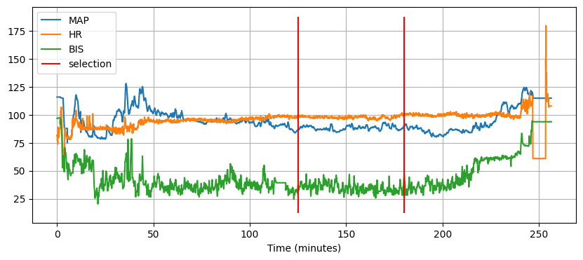
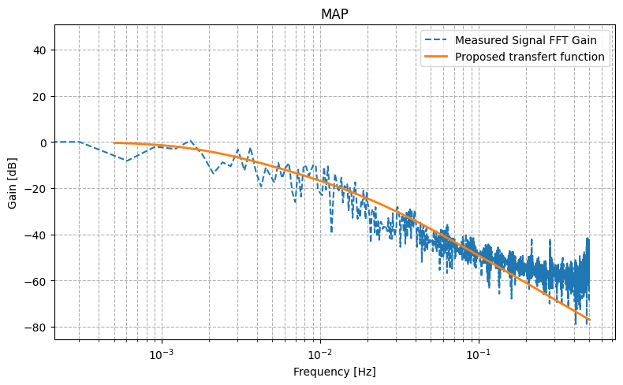
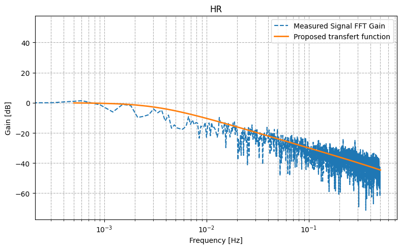
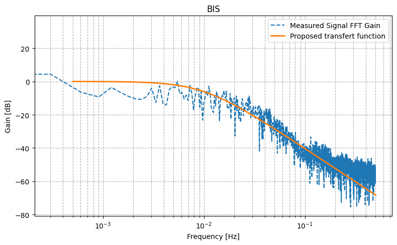
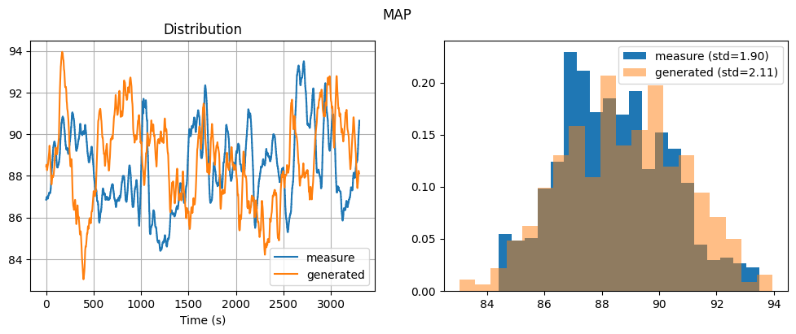
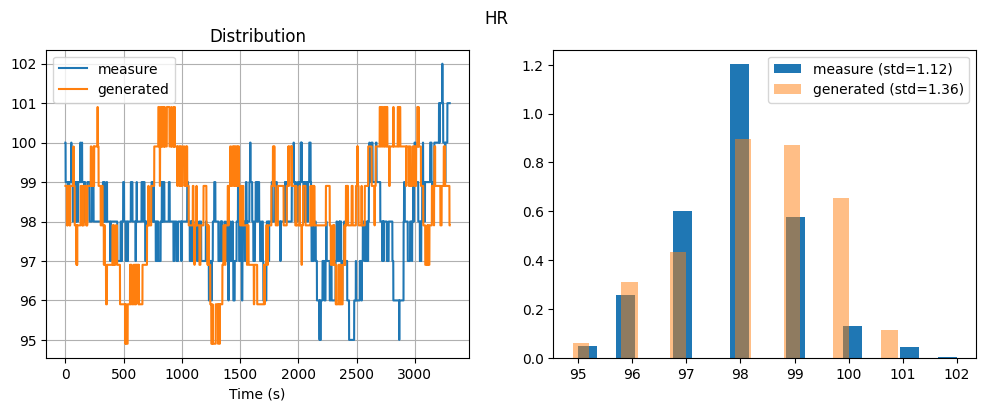

.. _noise_identif:

Noise identification
=====================

In this page we present the process to identify noise on MAP, HR and BIS signals.

To this end, we used data from VitalDB and particularly the case 4864, which present a long steady state period during surgery.

    Signals of the case 4864 and selection of the data for identification.

After selecting the steady state period, we used the data to plot gain Bode diagrams for each signal and fitted three different transfert functions to fit the data.

    Gain Bode diagram from MAP signal and identify transfert function.

    Gain Bode diagram from HR signal and identify transfert function.

    Gain Bode diagram from BIS signal and identify transfert function.

Then we set the standard deviation of the white noise for each noise such that each noise generated get the same distribution than in the data. For HR we also ceiled the generated noise to the closest integer to better reproduce the real comportment of the signal.

    Comparaison of generated noise versus clinical data for MAP.

    Comparaison of generated noise versus clinical data for hr_base.

.. figure:: ../images/bis_noise.png
    :alt: Distribution and time representation of BIS noise data vs generated noise.
    :align: center
    :width: 80%

    Comparaison of generated noise versus clinical data for BIS.

The resulting generators include:

- For MAP, the standard deviation of the white noise is 30 and the filter is a second-order low-pass noise filter with damping ratio ξ=2 and cutoff frequency ω=0.01.
- For HR, the standard deviation of the white noise is 17 and the filter is a second-order low-pass noise filter with damping ratio ξ=10 and cutoff frequency ω=0.02. In addition, the output is ceiled to the nearest integer.
- For BIS, the standard deviation of the white noise is 35 and the filter is a second-order low-pass noise filter with damping ratio ξ=1 and cutoff frequency ω=0.04.

The code of this process is available on this `Notebook <https://github.com/AnesthesiaSimulation/PAS_vs_vitalDB/blob/main/scripts/identify_noise.ipynb>`_.